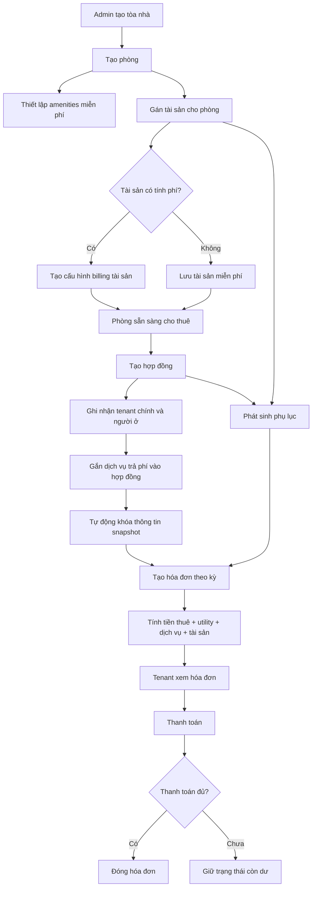

# SmartStay Activity Diagram

Tài liệu này là chuẩn vận hành cho SmartStay BMS. Mọi sửa đổi ở schema, service và UI đều bám theo luồng dưới đây.

## 1. Tổng luồng vận hành

## 2. Luồng chi tiết

### 2.1 Tạo tòa nhà

Actor: Admin

Steps:
1. Tạo building với mã, tên, địa chỉ, loại hình.
2. Hệ thống lưu building và mở ngữ cảnh quản lý cho building đó.
3. Building trở thành cha của room, service scope và policy scope.

Điều kiện:
- Building code không trùng.
- Building không bị đánh dấu xóa mềm.

Trigger hệ thống:
- Bật building làm scope hợp lệ cho utility policy.

Output:
- Building hoạt động, dùng được cho tạo phòng và báo cáo.

### 2.2 Tạo phòng

Actor: Admin

Steps:
1. Chọn building.
2. Nhập mã phòng, tầng, diện tích, giá cơ bản, sức chứa.
3. Chọn amenities miễn phí.
4. Hệ thống derive room type từ diện tích nếu chưa chọn rõ.
5. Lưu phòng ở trạng thái `Vacant`.

Điều kiện:
- Room code duy nhất trong building.
- Diện tích và giá không âm.
- Sức chứa hợp lệ.

Nhánh rẽ:
- Nếu không chọn room type, hệ thống tự suy ra từ diện tích.

Trigger hệ thống:
- Room trở thành scope hợp lệ cho utility policy và hợp đồng.

Output:
- Phòng sẵn sàng gán tài sản hoặc tạo hợp đồng.

### 2.3 Gán tài sản

Actor: Admin / Staff

Steps:
1. Chọn tài sản từ kho hoặc tạo mới tài sản.
2. Gán tài sản vào phòng.
3. Khai báo tình trạng vật lý.
4. Nếu là tài sản có tính phí, bật billing, nhập phí tháng và ngày hiệu lực.
5. Hệ thống tự tạo phụ lục nếu phòng đang có hợp đồng hiệu lực.

Điều kiện:
- Tài sản phải tồn tại.
- Nếu bật billing thì monthly charge phải >= 0.
- Nếu tài sản hỏng hoặc dừng tính phí thì phải có ngày dừng/tạm dừng.

Nhánh rẽ:
- Tài sản miễn phí: chỉ hiển thị ở room detail, không vào invoice.
- Tài sản tính phí: xuất hiện ở invoice breakdown.
- Tài sản hỏng: trạng thái billing chuyển `suspended` hoặc `stopped`.

Trigger hệ thống:
- Tự chuẩn hóa `billing_label`, `billing_start_date`, `billing_status`.
- Tự tạo addendum khi thêm hoặc đổi giá tài sản trong phòng đang có hợp đồng.

Output:
- Room asset rõ tình trạng vật lý và trạng thái tính phí.

### 2.4 Tạo hợp đồng

Actor: Admin / Staff

Steps:
1. Chọn phòng trống.
2. Chọn tenant đại diện và danh sách occupants.
3. Chọn chu kỳ thanh toán, ngày đến hạn, tiền thuê, cọc.
4. Gắn utility policy nếu có.
5. Gắn dịch vụ trả phí theo hợp đồng.
6. Hệ thống tạo contract, contract tenants, room occupants.
7. Hệ thống chuyển phòng sang `Occupied`.

Điều kiện:
- Không được chồng lấn hợp đồng active/pending trên cùng phòng.
- Occupant count không vượt max occupancy.
- Có tenant đại diện hợp lệ.

Nhánh rẽ:
- Nếu có dịch vụ trả phí, snapshot đơn giá tại thời điểm tạo hợp đồng.
- Nếu có tài sản billable trong phòng, tài sản đó sẽ được lấy vào hóa đơn theo kỳ nếu còn hiệu lực billing.

Trigger hệ thống:
- Khóa snapshot tiền thuê, dịch vụ và utility mode.

Output:
- Hợp đồng active, sẵn sàng phát sinh hóa đơn.

### 2.5 Phụ lục hợp đồng

Actor: Admin / Staff / Hệ thống

Steps:
1. Phụ lục được tạo thủ công hoặc tự động.
2. Loại phụ lục phải rõ: thêm tài sản, đổi giá tài sản, đổi giá thuê, đổi dịch vụ, đổi phòng, chính sách khác.
3. Phụ lục lưu code, tiêu đề, nội dung, ngày hiệu lực, trạng thái và file ký.

Điều kiện:
- Phụ lục phải gắn với một contract.
- Nếu trạng thái signed thì file ký là tùy chọn theo nghiệp vụ hiện tại nhưng URL phải hợp lệ nếu có.

Trigger hệ thống:
- Khi room asset billable được thêm hoặc đổi giá trong thời gian hợp đồng còn hiệu lực.

Output:
- Contract có lịch sử thay đổi rõ ràng, tenant portal đọc được.

### 2.6 Tạo hóa đơn theo kỳ

Actor: Admin / Staff / Scheduler

Steps:
1. Chọn kỳ thanh toán `YYYY-MM`.
2. Hệ thống lấy tất cả hợp đồng active đủ điều kiện.
3. Hệ thống kiểm tra trùng invoice theo contract + period.
4. Hệ thống build draft gồm:
   - Tiền thuê phòng.
   - Dịch vụ trả phí theo hợp đồng.
   - Điện.
   - Nước.
   - Tài sản billable đang hiệu lực.
   - Giảm trừ nếu có.
5. Hệ thống lưu invoice, invoice_items và utility snapshot trong cùng transaction.

Điều kiện:
- Không tạo trùng invoice chưa hủy.
- Utility policy phải resolve được.
- Occupants for billing phải hợp lệ.

Nhánh rẽ:
- Nếu asset billing chỉ hiệu lực một phần tháng, hệ thống prorate theo số ngày chồng lấn.
- Nếu asset billing bị suspended/stopped, không cộng vào hóa đơn.

Trigger hệ thống:
- Ghi `item_type` chuẩn cho từng dòng hóa đơn.

Output:
- Invoice có breakdown rõ ràng, không phải suy đoán từ mô tả text.

### 2.7 Tenant xem hóa đơn

Actor: Tenant

Steps:
1. Tenant mở portal.
2. Hệ thống chỉ trả invoice của các contract tenant đang liên kết.
3. Hóa đơn hiển thị nhóm phí rõ ràng:
   - Tiền thuê.
   - Điện.
   - Nước.
   - Dịch vụ.
   - Thiết bị tính phí.
   - Giảm trừ.
4. Tenant xem lịch sử thanh toán và thông tin chuyển khoản.

Điều kiện:
- Profile phải liên kết được với tenant.

Output:
- Tenant hiểu đúng số tiền và nguồn phát sinh.

### 2.8 Thanh toán

Actor: Tenant / Admin / Webhook

Steps:
1. Tenant chuyển khoản hoặc thanh toán tiền mặt.
2. Hệ thống ghi payment attempt hoặc payment đã xác nhận.
3. Invoice cập nhật amount paid, balance due và status.

Điều kiện:
- Số tiền thanh toán không vượt quá số dư còn lại.

Nhánh rẽ:
- Thanh toán đủ: `Paid`.
- Thanh toán một phần: `Partial`.
- Quá hạn chưa thanh toán: `Overdue`.

Trigger hệ thống:
- Portal và admin finance realtime refetch theo invoice.

Output:
- Công nợ đồng bộ giữa invoice, payment history và portal.

## 3. Quy tắc bất biến

1. Amenities là miễn phí và chỉ dùng cho mô tả/phụ trợ utility policy, không hiển thị JSON raw ra UI.
2. Services là khoản trả phí theo hợp đồng, tách riêng khỏi amenities.
3. Assets có thể miễn phí hoặc billable; nếu billable thì phải có trạng thái billing rõ ràng.
4. Addendum là nguồn sự thật cho thay đổi sau khi hợp đồng đã chạy.
5. Invoice items phải có `item_type` chuẩn, không suy đoán mơ hồ từ description.
6. Tenant portal chỉ hiển thị nhãn nghiệp vụ, không lộ ID kỹ thuật.
